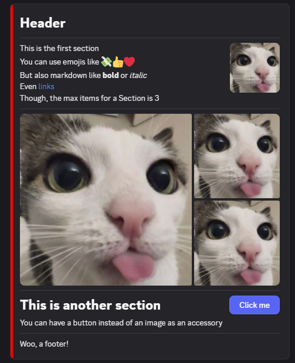

# Discord Components v2
Since March of 2025, Discord has added a new way of using components in messages!<br>
This mode only works if you have `1 << 15` as `flags` in your message data.
For more information, visit [the Discord Developer Documentation page](https://discord.com/developers/docs/components/reference)
<hr>

```js
flags: 1 << 15,
components: [
    new Container().addComponents(
        new TextDisplay().setContent("# Header"),
        // You can add a separator between sections
        new Separator(),
        // You can have multiple sections in a container
        new Section().addComponents(
            new TextDisplay().setContent("This is the first section"),
            new TextDisplay().setContent("You can use emojis like 💸👍❤"),
            new TextDisplay().setContent("But also markdown like **bold** or *italic*\nEven [links](https://google.com)\nThough, the max items for a Section is 3"),
        ).setAccessory(
            // You can add an image as an accessory
            new Thumbnail().setMedia({url:"https://cdn.discordapp.com/avatars/723553355753848832/19183e9b8b7ac05c62f8847e1a1260a5.png?size=512"})
        ),
        new Separator(),
        // Maybe have a media gallery instead of a section?
        new MediaGallery().addItems(
            new MediaGalleryItem().setURL("https://cdn.discordapp.com/avatars/723553355753848832/19183e9b8b7ac05c62f8847e1a1260a5.png?size=512"),
            new MediaGalleryItem().setURL("https://cdn.discordapp.com/avatars/723553355753848832/19183e9b8b7ac05c62f8847e1a1260a5.png?size=512"),
            new MediaGalleryItem().setURL("https://cdn.discordapp.com/avatars/723553355753848832/19183e9b8b7ac05c62f8847e1a1260a5.png?size=512")
        ),
        new Separator(),
        new Section().addComponents(
            new TextDisplay().setContent("# This is another section"),
            new TextDisplay().setContent("You can have a button instead of an image as an accessory"),
        ).setAccessory(
            new Button().setStyle(1).setLabel("Click me").setCustomId("button1")
        ),
        new Separator(),
        new TextDisplay().setContent("Woo, a footer!")
    ).setAccentColor(0xFF0000 /* You can also make it look like an embed by adding an accent color */)
    .setSpoiler(false /* You can also mark the containers as spoilers */).build(),
]
```

